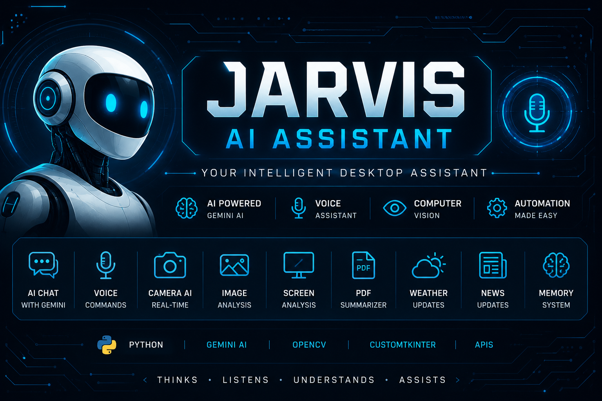
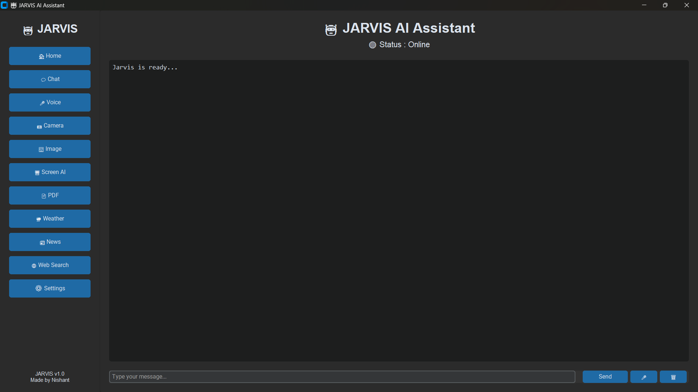
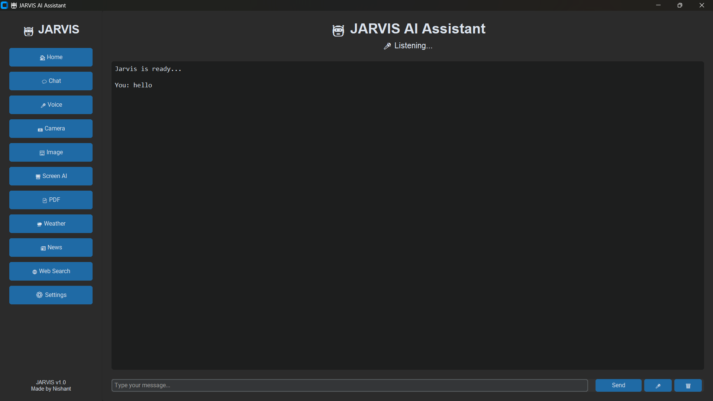
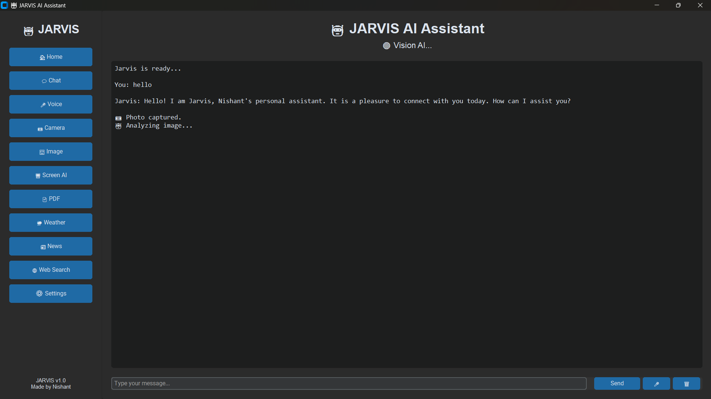
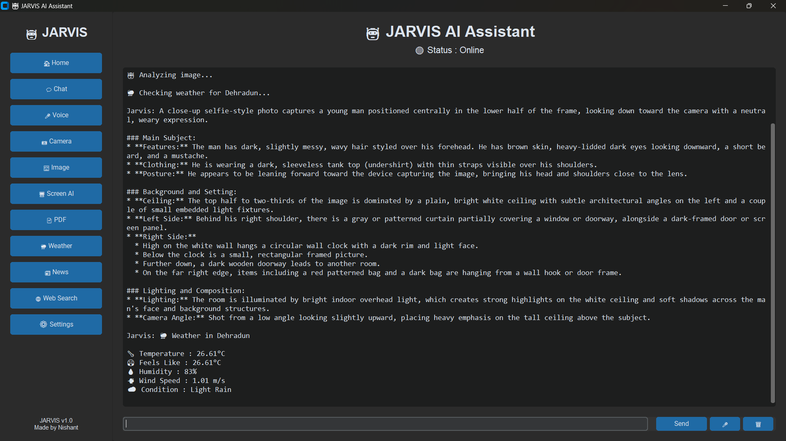

<p align="center">
  
</p>

<h1 align="center">🤖 JARVIS AI Assistant</h1>

<p align="center">
An AI-powered Desktop Assistant built with Python, Gemini AI, Voice Recognition, Computer Vision, and Automation.
</p>

<p align="center">


</p>

---

# ✨ Features

- 💬 AI Chat using Google Gemini
- 🎤 Voice Assistant
- 🔊 Text-to-Speech
- 📷 Camera AI
- 🖼 Image Analysis
- 🖥 Screen Analysis
- 📄 PDF Reader & Summarizer
- 🌦 Weather Information
- 📰 Latest News
- 🧠 Memory System
- 💾 Chat History
- ⚡ Fast Modern GUI
- 🌙 Dark Mode Interface

---

# 🛠 Tech Stack

- Python 3.13
- Google Gemini AI
- CustomTkinter
- OpenCV
- PyAutoGUI
- PyMuPDF
- SpeechRecognition
- Edge-TTS
- Pygame
- Requests

---

# 📂 Project Structure

```text
JARVIS-AI-Assistant/
│
├── assets/
│   ├── banner.png
│   ├── home.png
│   ├── voice.png
│   ├── camera.png
│   ├── image.png
│   ├── screen.png
│   └── weather.png
│
├── ai.py
├── gui.py
├── listen.py
├── speak.py
├── camera.py
├── vision.py
├── screen.py
├── memory.py
├── history.py
├── pdf_reader.py
├── weather.py
├── news.py
├── requirements.txt
└── README.md
```

---

# 🚀 Installation

## Clone Repository

```bash
git clone https://github.com/nishantc475-tech/JARVIS-AI-Assistant.git
```

```bash
cd JARVIS-AI-Assistant
```

---

## Install Dependencies

```bash
pip install -r requirements.txt
```

---

## Run Project

```bash
python gui.py
```

---

# 📸 Screenshots

## 🏠 Home Screen



---

## 🎤 Voice Assistant



---

## 📷 Camera AI



---

## 🖼 Image Analysis


---

## 🖥 Screen Analysis


---

## 🌦 Weather Module



---

# 💡 Future Improvements

- 🤖 AI Automation
- 📅 Calendar Integration
- 📧 Email Assistant
- 🌐 Browser Automation
- 🎵 Music Control
- 📝 Notes Manager
- 💻 System Monitoring
- 🔥 Wake Word Detection ("Hey Jarvis")

---

# 👨‍💻 Author

**Nishant Chauhan**

🎓 B.Tech CSE (AI & ML)

Dev Bhoomi Uttarakhand University

GitHub:
https://github.com/nishantc475-tech

---

# ⭐ Support

If you like this project,

⭐ Star this repository

🍴 Fork it

🛠 Contribute to improve it

---

# 📜 License

This project is licensed under the MIT License.

---

<p align="center">
Made with ❤️ by Nishant Chauhan
</p>
